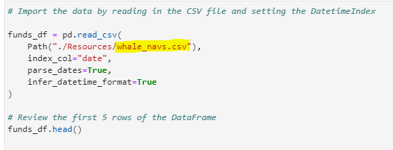

# Risk Return Analysis

### Risk Return Analysis application provides asset managers with an efficient and easy way to select a fund with the most investment potential based on key risk-management metrics: returns, risks, risk-return analysis, and diversification benefits.

---

## 

---

## Table of contents

1. [Technologies](#technologies)
2. [Installation Guide](#installation-guide)
3. [Usage](#usage)
4. [Contributors](#contributors)
5. [License](#license)

---

## Technologies

`Python 3.9`

`Jupyter lab`

_Prerequisites_

Pandas and Numpy are Python packages that provides fast, flexible, and expressive data structures designed to make working with large sets of data easy and intuitive.

- [pandas](https://github.com/pandas-dev/pandas) - For the documentation, installation guide and dependencies.
- [numpy](https://numpy.org/doc/) - For the NumPy manual.
- [matplotlib ](https://matplotlib.org/) - For guidance on how to start visualization, interactive visualization, styles and layouts customazation.

---

## Installation Guide

Jupyter lab is a preferred software to work with Risk Return Analysis application.<br/> Jupyter lab is a part of the **[anaconda](https://www.anaconda.com/)** distribution package and therefore it is recommended to download **anaconda** first.<br/> Once dowloaded, run the following command in your terminal to lauch Jupyter lab:

```python
jupyter lab
```

Before using the application first install the following dependencies by using your terminal:

To install pandas and NumPy run:

```python
#  PuPi
pip install pandas
pip install numpy
```

```python
# or conda
conda install pandas
conda install numpy
```

---

## Usage

> Application summary<br/>

Risk Return Analysis application takes you through the following stages of the quantitative analysis for the stock/fund selection:

- Performans
- Volatility
- Risk
- Risk-return profile
- Portfolio diversification
  <br/>

At the end of the analysis the investment opportunities are identified. <br/>

> Getting started<br/>

- To use Risk Return Analysis application first clone the repository to your PC. The repository comes with **risk_return_analysis.ipynb** application, as well as a sample of data file covering the NAV of Funds to be analysed and the closing price of S&P 500 for the period of Oct 2014- Sep 2020. <br/>
- Open `Jupyter lab` as per the instructions in the [Installation Guide](#installation-guide) to run the application.<br/>
- Next, save your data file in the **Resources/** directory and adjust the code with your data file's name:<br/>
  <br/>
  At the very end of the application you can find a summary and recommendations drawn based on the quantitiative analyses performed. It can serve as a sample for your analysis and reporting.

---

## Contributors

Contact Details:

Boris Dudkin:

- [Email](boris.dudkin@gmail.com)
- [LinkedIn](www.linkedin.com/in/Boris-Dudkin)

---

## License

MIT
